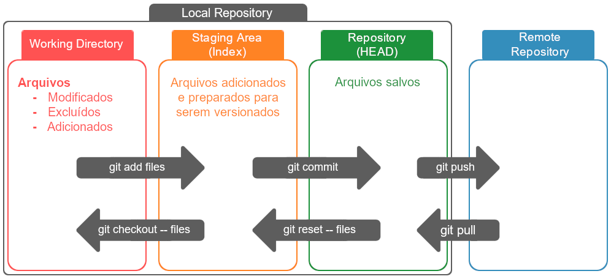

# API de Biblioteca

## Descrição do projeto
Esta é uma API RESTful para gerenciar uma biblioteca, oferecendo funcionalidades para cadastro de livros, usuários, empréstimos e devoluções, além de relatórios básicos.

## Como baixar o repositório
1. Clone o repositório:
   ```bash
   git clone git@github.com:vngoliveira/LibraryApi.git
2. Acesse o diretório do projeto:
   ```bash
   cd LibraryApi
3. Instale as dependências e inicie a API:
   ```bash
    cd libraryapi
    npm install
    node app.js
4. Configure o banco de dados no arquivo .env dentro de libraryapi:
   ```bash
   DB_HOST=localhost
   DB_USER=root
   DB_PASSWORD=senha
   DB_NAME=library
   DB_PORT=3306
   DB_DIALECT=mysql
7. Instale as dependências e inicie o frontend:
   ```bash
   cd ..
   cd libraryweb
   npm install
   npm start
## Pré-requisitos
- Node.js 20.x ou superior
- MySQL 8.x
- Docker (opcional, para ambiente conteinerizado)
## Contribuindo
Veja o arquivo CONTRIBUTING.md para mais informações sobre como contribuir.
## Autores
- André Crispim de Oliveira - 01008087
- Maria Micaelle da Silva Aguiar - 01461200
- Rafael Câmara Albuquerque Alheiros - 011018601
- Vitoria Nathaly Gomes de Oliveira - 01482475
## Fluxo de Trabalho

## Licença
Este projeto está licenciado sob a Creative Commons Attribution 4.0.
